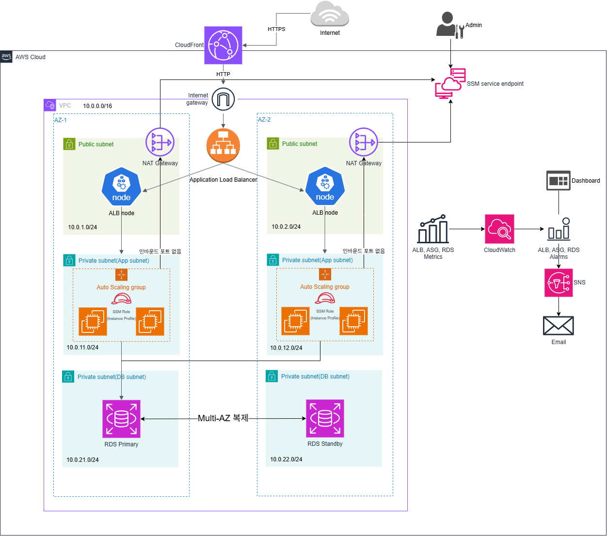

# 3-Tier Web Infrastructure

AWS 위에 Multi-AZ 고가용성 웹 서비스 인프라를 Terraform으로 구축한 프로젝트입니다.
표준 3-tier 아키텍처(Web/App/DB)에 CI/CD 배포 자동화를 결합했습니다.

## 아키텍처



## 구성 요소

- **Network**: VPC(10.0.0.0/16), 3계층 서브넷 6개, Multi-AZ 배치
- **컴퓨트**: EC2 Auto Scaling Group (Private Subnet, Multi-AZ)
- **로드밸런서**: Application Load Balancer (Public Subnet)
- **CDN**: CloudFront Distribution
- **데이터베이스**: RDS Multi-AZ (자동 페일오버)
- **NAT Gateway**: 각 AZ의 Public Subnet에 배치, Multi-AZ 독립성 확보

## 기술 스택

- **IaC**: Terraform
- **Cloud**: AWS (VPC, EC2, ALB, RDS, CloudFront, NAT Gateway)
- **CI/CD**: (예정)

## 파일 구조

```
3tier-portfolio/
├── README.md
├── architecture.png       # 아키텍처 다이어그램
├── docs/
│   └── decisions.md       # 각 결정의 근거
└── terraform/
    ├── main.tf            # Provider 설정
    ├── variables.tf       # 변수 정의
    ├── vpc.tf             # VPC, IGW, 라우팅 테이블
    ├── subnets.tf         # 서브넷 6개 (Public 2, App 2, DB 2)
    ├── nat.tf             # NAT Gateway, EIP
    ├── security_groups.tf # ALB, EC2, RDS 보안 그룹
    ├── alb.tf             # ALB, Target Group, Listener
    ├── ec2.tf             # Launch Template, Auto Scaling Group
    ├── rds.tf             # RDS Multi-AZ, DB Subnet Group
    ├── cloudfront.tf      # CloudFront Distribution
    ├── outputs.tf         # 출력값
    └── .gitignore
```

## 실행 방법

```bash
cd terraform
terraform init
terraform plan
terraform apply
```

## 삭제 방법

```bash
terraform destroy
```

## 주요 설계 결정

각 리소스와 구성에 대한 결정 근거는 [decisions.md](./docs/decisions.md)를 참고.

## 확장 시나리오

현재 학습 목적의 최소 구성이지만, 아래 방향으로 확장 가능:

- **읽기 확장**: RDS Read Replica 추가
- **재해 복구**: Cross-Region Replication
- **보안**: WAF 규칙, Secrets Manager 통합
- **관측성**: CloudWatch Alarm, X-Ray 트레이싱
- **CI/CD**: GitHub Actions → ECR → EC2 자동 배포 (다음 단계)