# 3-Tier Web Infrastructure

AWS에 Multi-AZ 고가용성 웹 인프라를 Terraform으로 구축하고, 장애 복구와 모니터링 동작을 실측 검증한 프로젝트다.

## 배경

시스템 운영 업무를 4년간 수행하며 모니터링 도구로 이벤트를 확인하고 보고하는 역할을 맡았다.
장애를 감지하는 쪽에 있었지만 구성을 직접 설계하거나 조치할 권한은 없었고, "왜 이렇게
구성되어 있는가"를 알 수 없다는 점이 계속 남았다.

이 프로젝트는 그 반대편을 직접 해보기 위한 것이다. 인프라를 코드로 정의하고, 장애를
일부러 일으켜 복구 과정을 측정하고, 알람이 실제로 동작하는지 검증했다. 감지하는 입장에서
알고 있던 것들을 설계하는 입장에서 다시 확인하는 과정이었다.

목표를 이렇게 잡았다.

- **재현 가능성** — clone 후 `apply` 한 번으로 동일한 인프라가 구성될 것
- **검증** — 구성했다고 주장하지 않고, 동작을 측정한 결과를 남길 것
- **근거** — 모든 설계 결정에 이유와 트레이드오프를 기록할 것

## 아키텍처


## 구성 요소

- **Network**: VPC(10.0.0.0/16), 3계층 서브넷 6개, Multi-AZ 배치
- **컴퓨트**: EC2 Auto Scaling Group (Private Subnet, Multi-AZ)
- **로드밸런서**: Application Load Balancer (Public Subnet)
- **CDN**: CloudFront Distribution
- **데이터베이스**: RDS Multi-AZ (자동 페일오버)
- **NAT Gateway**: 각 AZ의 Public Subnet에 배치, Multi-AZ 독립성 확보
- **모니터링**: CloudWatch 알람 3종 + 대시보드, SNS 이메일 알림
- **접근 제어**: SSM Session Manager (Bastion 없음), IAM 인스턴스 프로파일

## 검증 결과

구축한 인프라가 의도대로 동작하는지 항목별로 검증했다. 각 항목의 원본 캡처와 로그는
[`docs/evidence/`](docs/evidence/)에 있다.

### 인프라 구성

| 검증 항목 | 결과 |
|---|---|
| 리소스 생성 | 47개 리소스 생성 완료 |
| 멱등성 | apply 직후 `terraform plan` → `No changes` |
| Multi-AZ 배치 | 서브넷 6개가 2개 AZ에 분산 (Public/App/DB × 2) |
| NAT 이중화 | AZ별 독립 NAT Gateway, 서로 다른 EIP 할당 |
| 서비스 응답 | ALB / CloudFront 모두 HTTP 200 |

<details>
<summary>상세 보기</summary>

**AZ별 NAT 분리 확인** — 각 AZ의 인스턴스에서 외부로 나가는 공인 IP가 다르다.

| AZ | 아웃바운드 IP |
|---|---|
| ap-northeast-2a | 13.124.167.31 |
| ap-northeast-2c | 54.116.247.172 |

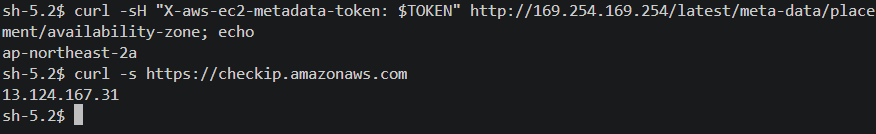
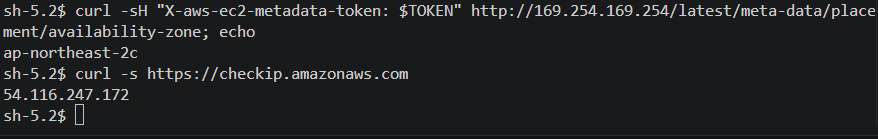

단일 NAT 구성 대비 비용은 증가하지만, 한 AZ의 NAT 장애가 다른 AZ로 전파되지 않는다.
판단 근거는 [decisions.md](docs/decisions.md) 참고.

**로드밸런싱 동작** — 동일 URL에 반복 요청 시 서로 다른 AZ의 인스턴스가 응답한다.

| 경로 | 응답 인스턴스 |
|---|---|
| ALB (HTTP) | `ip-10-0-11-163` / `ip-10-0-12-177` |
| CloudFront (HTTPS) | `ip-10-0-11-163` / `ip-10-0-12-177` |

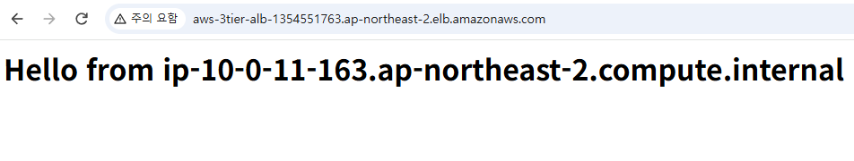
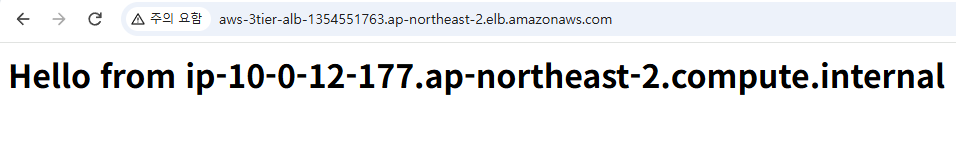
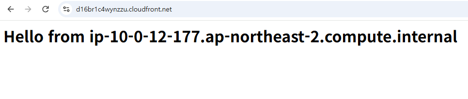

`10.0.11.x`와 `10.0.12.x`는 각각 다른 AZ의 App 서브넷이다.
TLS는 CloudFront에서 종단하고 ALB로는 HTTP로 전달한다.

**Terraform 출력** — [terraform_output.txt](docs/evidence/logs/terraform_output.txt) ·
[terraform_state_list.txt](docs/evidence/logs/terraform_state_list.txt) ·
[terraform_plan_nochanges.txt](docs/evidence/logs/terraform_plan_nochanges.txt)

**콘솔 캡처** — [infra_capture/](docs/evidence/images/infra_capture/) (VPC, 서브넷, IGW, NAT, SG 3종, ALB, ASG, Launch Template, RDS, CloudFront)

**SSM 접근 경로** — App 인스턴스는 프라이빗 서브넷에 있고 인바운드 규칙이 없다.
Bastion 없이 SSM Session Manager로 접근하며, 필요한 IAM 역할과 인스턴스 프로파일을
Terraform으로 관리한다.

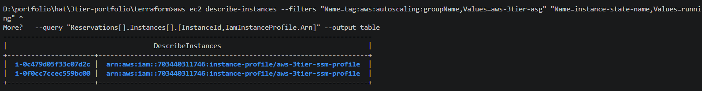

구축 중 계정 수준 설정(Default Host Management Configuration)에 의존해 접근이
성립하던 상태를 발견해 코드로 이관했다. 자세한 내용은
[decisions.md](docs/decisions.md) 참고.

</details>

### 네트워크 격리

의도한 경로만 열려 있고 나머지는 막혀 있는지, **차단되는 것도 함께 검증**했다.

| 검증 항목 | 기대 | 결과 |
|---|---|---|
| DB 엔드포인트 DNS 해석 | 프라이빗 IP | `10.0.22.234` |
| 인터넷 → RDS 3306 | 차단 | TCP 연결 실패, ICMP 타임아웃 |
| App 서브넷 → RDS 3306 | 허용 | MySQL 8.0.46 접속 성공 |
| ALB → App 인스턴스 | 허용 | HTTP 200 |

<details>
<summary>상세 보기</summary>

**인터넷에서 DB 접근 차단** — 로컬 PC(192.168.219.101)에서 DB 엔드포인트로 시도한 결과

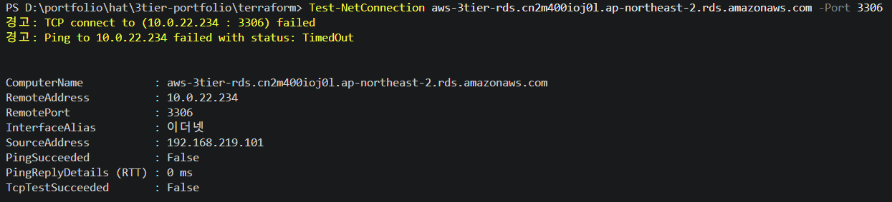

DNS는 정상 해석되지만(`10.0.22.234`) 프라이빗 대역이므로 인터넷에서 라우팅 경로가 없다.

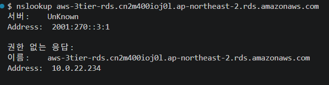

**App 서브넷에서는 접근 가능** — 같은 엔드포인트로 SSM 세션을 통해 접속

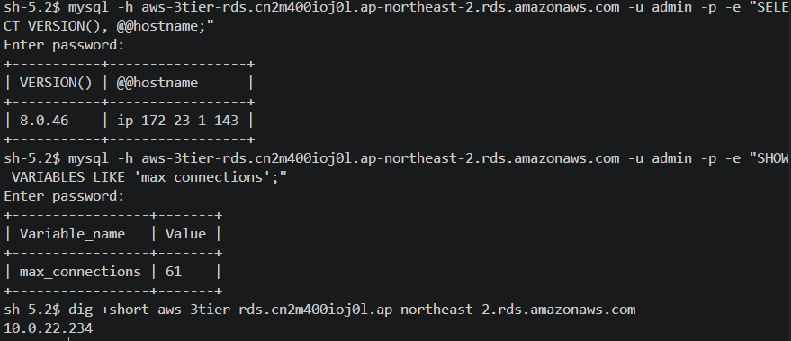

동일한 엔드포인트가 위치에 따라 접근 가능 여부가 갈리는 것이 서브넷 격리의 결과다.

</details>

### 장애 복구

세 가지 장애 유형을 실제로 발생시키고 서비스 영향을 초 단위로 측정했다.
측정 기준을 인프라 이벤트 로그와 클라이언트 응답 양쪽에서 잡았고, 두 값이 일치하지 않는 경우가 있었다.

| 장애 유형 | 서비스 영향 | 복구 |
|---|---|---|
| 인스턴스 강제 종료 (1차) | 35초 구간에 요청 9건 실패 | ASG 자동 대체 |
| 인스턴스 강제 종료 (2차) | 18초 구간에 요청 6건 실패 | ASG 자동 대체 |
| 웹서버 프로세스 중지 | 8초간 502 발생 후 정상화 | ALB 라우팅 제외 → ASG 교체 |
| RDS 강제 페일오버 (2회) | AWS 기준 40~44초 / 클라이언트 재연결까지 약 134초 | 대기 AZ로 자동 전환 |

<details>
<summary>상세 보기</summary>

**세 유형의 장애 패턴이 서로 달랐다.**

인스턴스를 강제 종료하면 ALB가 상태를 감지할 때까지 일부 요청이 죽은 타겟으로 분산된다.
1차와 2차의 수치 차이는 실패 유형 때문이다. `502`는 ALB가 즉시 반환한 것이고 `000`은
클라이언트 타임아웃(3초)이라, `000` 비중이 높을수록 같은 실패 건수라도 구간이 길어진다.

반면 웹서버 프로세스만 중지하면 인스턴스는 살아 있으므로 타겟이 등록 상태를 유지한다.
502가 약 8초간 발생한 뒤 ALB가 해당 타겟을 라우팅에서 제외해 서비스가 정상화되고,
상태 표시(`unhealthy`)는 그보다 뒤인 21:42:04에 확인됐다. **라우팅 제외가 먼저,
상태 반영이 나중**이라는 순서를 확인할 수 있다.

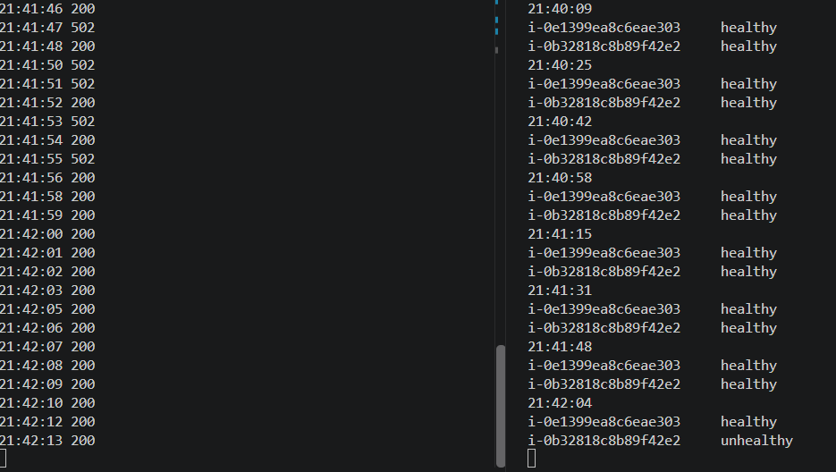

이후 ASG(`health_check_type = ELB`)가 인스턴스를 교체했다.

| 시각 | 상태 |
|---|---|
| 21:42:04 | 타겟 unhealthy 전환 |
| 21:42:54 | 신규 인스턴스 시작, 기존 draining |
| 21:44:01 | 신규 인스턴스 healthy |
| 21:47:53 | 기존 타겟 완전 제외 |

draining 구간이 정확히 5분인데, `deregistration_delay` 기본값 300초와 일치한다.

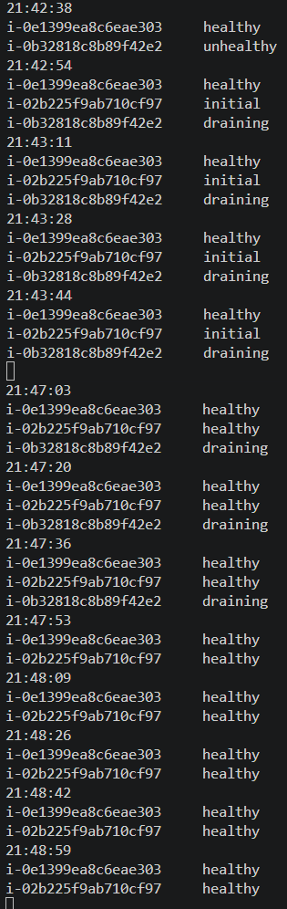

**RDS Multi-AZ 페일오버**는 2회 측정했다. 그런데 AWS가 보고하는 페일오버 완료 시각과
애플리케이션이 실제로 재연결한 시각이 크게 달랐다.

| 측정 기준 | 1차 | 2차 |
|---|---|---|
| AWS 이벤트 로그 (started → completed) | 44초 | 40초 |
| 클라이언트 재연결까지 (2차 관측) | — | 약 134초 |

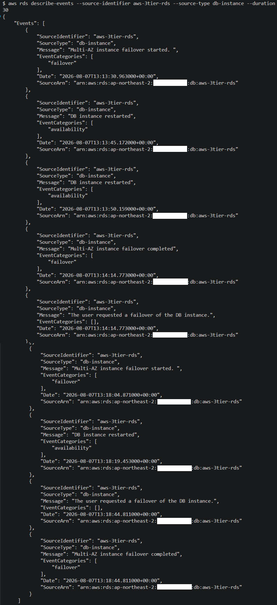

2차 시도의 타임라인을 대조하면 차이가 드러난다.

| 시각 | 사건 | 출처 |
|---|---|---|
| 13:18:04.548 | 마지막 정상 응답 | 클라이언트 |
| 13:18:04.871 | 페일오버 시작 | AWS 이벤트 |
| 13:18:44.811 | **페일오버 완료** | AWS 이벤트 |
| 13:20:17.080 | 클라이언트가 실패 인지 | 클라이언트 |
| 13:20:18.136 | 재연결 성공 | 클라이언트 |

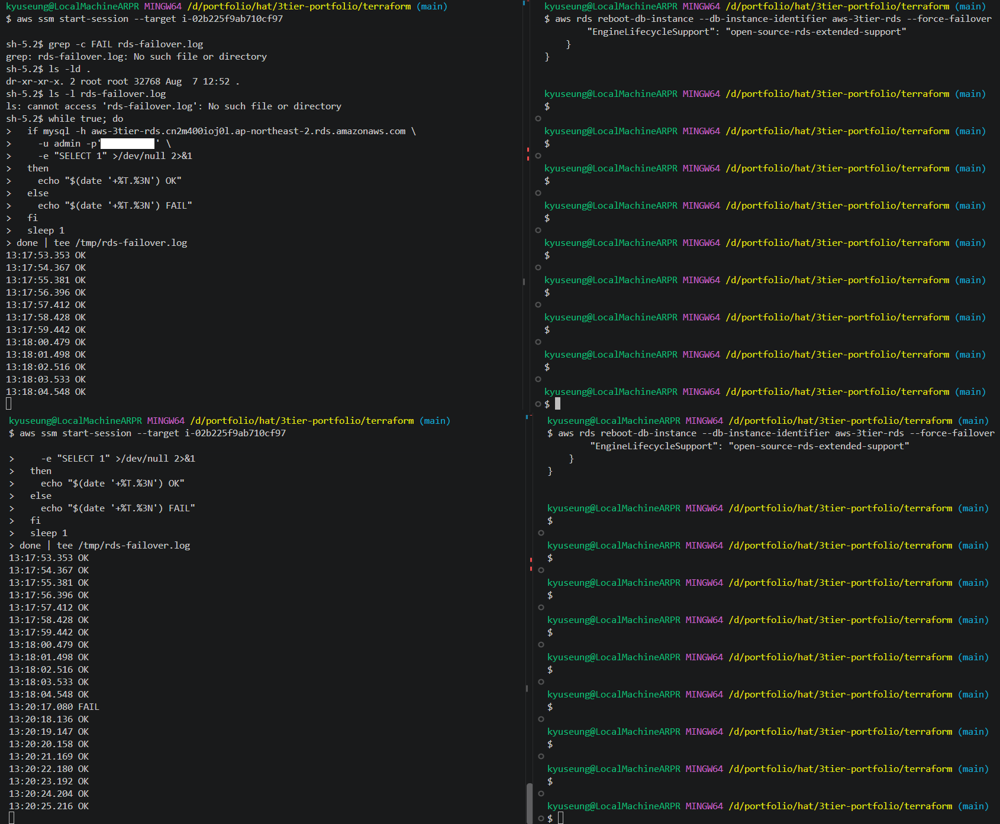

AWS가 완료를 보고한 뒤에도 **약 93초간 클라이언트는 장애를 인지조차 하지 못했다.**
페일오버로 상대편 인스턴스가 교체됐지만 기존 TCP 연결이 정상적으로 종료되지 않아,
클라이언트가 커널의 재전송 타임아웃을 기다린 것으로 보인다. 그 시점에야 연결이
끊겼음을 인지하고 재연결했고, 갱신된 DNS를 통해 새 인스턴스에 접속했다.

**관리형 서비스의 페일오버 완료 시각과 애플리케이션 체감 복구 시각은 다르다.**
실질적인 RTO는 AWS가 아니라 클라이언트 측 소켓 타임아웃과 커넥션 검증 설정이 결정한다.
운영 환경이라면 커넥션 풀의 `socketTimeout`, TCP keepalive, 커넥션 유효성 검사를
함께 조정해야 한다.

> 패킷 수준 분석은 하지 않았으므로 원인은 추정이다. 다만 AWS 이벤트 로그만으로
> 복구 시간을 산정하면 실제 서비스 영향을 과소평가하게 된다는 점은 실측으로 확인했다.

**측정 로그** — [terminate-1st-35s.log](docs/evidence/logs/terminate-1st-35s.log) ·
[terminate-2nd-18s.log](docs/evidence/logs/terminate-2nd-18s.log) ·
[httpd-health.log](docs/evidence/logs/httpd-health.log)

</details>

### 모니터링 및 알람

알람은 지표를 감시하는 것이 아니라 **사람이 개입해야 하는 시점을 감시하는 것**이라고 보고,
자동 복구 시간을 기준으로 임계값을 설계했다.

| 알람 | 조건 | 역할 |
|---|---|---|
| `alb-unhealthy` | UnHealthyHostCount ≥ 1 (3분 중 1회) | 조기 경보 |
| `alb-healthy` | HealthyHostCount < 2, 6분 연속 | SLO 위반 |
| `rds-freestorage` | 여유 공간 20% 미만, 20분 지속 | 자원 고갈 |

<details>
<summary>상세 보기</summary>

**두 ALB 알람의 역할을 분리한 것이 핵심이다.** ASG 자가치유가 3~5분 소요되므로,
그 시간 안에 복구되는 상황에 알람을 울리면 대응할 필요 없는 노이즈가 된다.
`alb-healthy`의 6분 조건은 "자가치유가 실패했다"를 판정하기 위한 값이다.

실제 시연에서도 `alb-unhealthy`만 발생하고 `alb-healthy`는 발생하지 않았다.
설계 의도대로 동작한 결과다.

| 시각 | 상태 |
|---|---|
| 21:44:34 | OK → ALARM |
| 21:47:34 | ALARM → OK |

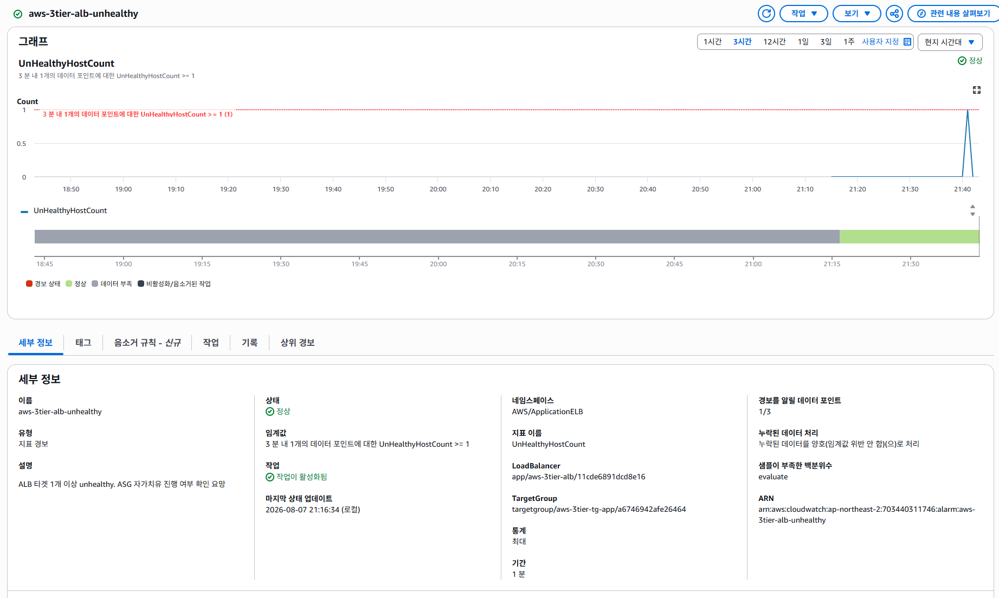
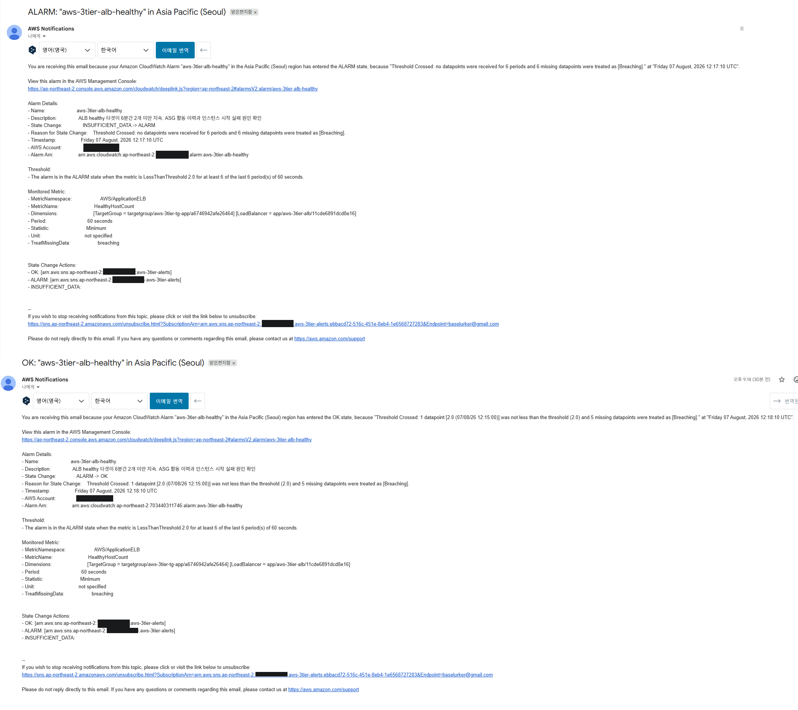
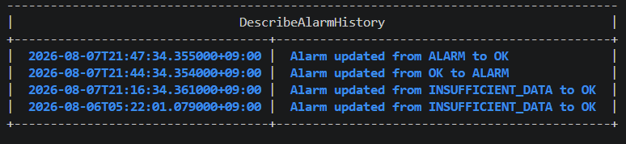

**`treat_missing_data`를 알람마다 다르게 설정했다.** 지표가 오지 않을 때 정상으로 볼지
비정상으로 볼지는 그 지표가 무엇을 측정하느냐에 달려 있다. UnHealthyHostCount는
이상 징후를 세므로 데이터가 없으면 이상도 없다(`notBreaching`). HealthyHostCount는
정상 용량을 세므로 데이터가 없으면 정상임을 확인할 수 없다(`breaching`).

**RDS 스토리지 임계값은 계산식으로 정의**해 스토리지 크기를 변경해도 비율이 유지되도록 했다.

```hcl
threshold = var.db_allocated_storage * local.gib * var.db_free_storage_threshold_ratio
```

**대시보드**는 위젯 12개를 3계층으로 배치했다. 장애 시 사람이 보는 순서를 따라
위에서 아래로 "지금 문제가 있는가 → 서비스 상태 → 자원 상태 → 추세" 순이다.

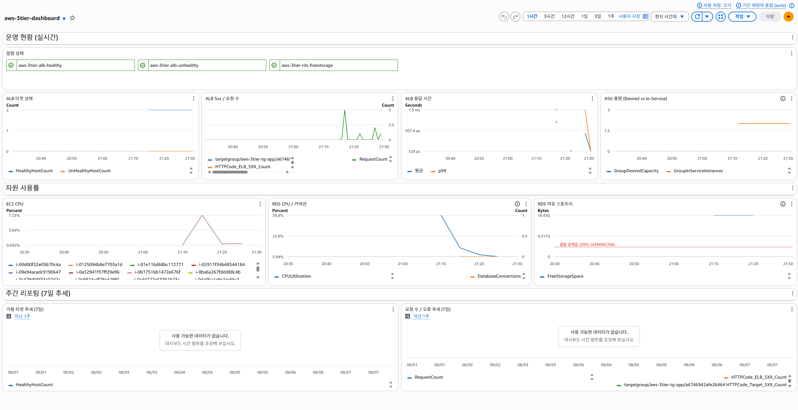
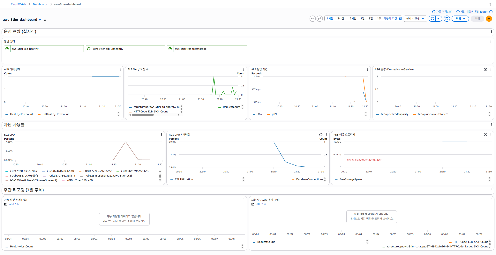

</details>

### 알람이 동작하지 않았던 문제

이 프로젝트에서 가장 많은 시간을 쓴 부분이다. **알람을 만들었지만 실제 장애를
감지하지 못했고**, 원인을 추적해 검증 방법 자체를 재설계했다.

<details>
<summary>상세 보기</summary>

**증상** — 인스턴스를 강제 종료했으나 `alb-unhealthy` 알람이 ALARM으로 전환되지 않았다.
알람 이력에는 apply 직후의 `INSUFFICIENT_DATA → OK` 기록만 남아 있었다.

**진단**

1. `aws sns publish`로 테스트 메시지를 발송해 정상 수신을 확인 → SNS 토픽·구독·전달 경로는 정상.
   원인 범위를 "알람 → SNS" 구간으로 좁혔다.
2. `describe-alarm-history`에 상태 전환 기록이 없음 → 메일이 누락된 것이 아니라
   알람 자체가 발화하지 않았다.
3. `get-metric-statistics`로 90분치 지표 원본을 조회 → 값이 0으로 유지된 것이 아니라
   **장애 시각 전후 2분간 데이터가 아예 발행되지 않았다.**

**원인** — 세 가지가 겹쳤다.

- **지표 선택 오류**: `UnHealthyHostCount`는 "등록된 타겟이 health check에 실패하는 상태"를
  센다. 인스턴스를 종료하면 타겟이 등록 해제되어 셀 대상 자체가 사라진다.
  *사라진 타겟*과 *실패하는 타겟*은 다른 지표로 봐야 한다.
- **장애 시 지표 결측**: 값이 1로 오른 것이 아니라 발행이 중단됐다.
- **`treat_missing_data = notBreaching`**: 그 결측 구간을 정상으로 처리했다.
  노이즈 방지를 위해 선택한 값이 실제 장애를 침묵시킨 셈이다.

**재설계** — 인스턴스 종료 대신 웹서버 프로세스만 중지하는 방식으로 바꿨다.
인스턴스가 살아 있어 타겟 등록이 유지되므로 `UnHealthyHostCount = 1`이 지속적으로
발행되고, 복구 시점도 제어할 수 있다. 이 방식으로 재검증한 결과 알람이 정상 발화했다.

추가로 `datapoints_to_alarm = 1`을 적용해, 짧게 지나가는 이벤트를 놓치지 않도록 했다.

**정리** — "알람이 있다"와 "알람이 동작한다"는 다르다. 알람 설정을 검증하지 않으면
장애 시 침묵하는 알람을 신뢰하게 된다. 지표가 무엇을 세는지 확인하지 않고 이름만 보고
선택한 것이 근본 원인이었다.

</details>

## 기술 스택

- **IaC**: Terraform
- **Cloud**: AWS (VPC, EC2, ALB, RDS, CloudFront, NAT Gateway, CloudWatch, SNS, SSM, IAM)
- **CI/CD**: (예정)

## 파일 구조

```
3tier-portfolio/
├── README.md
├── architecture.png
├── .gitignore
├── docs/
│   ├── decisions.md              # 설계 결정 근거
│   └── evidence/                 # 검증 자료
│       ├── images/
│       │   ├── infra_capture/    # 구성 확인 캡처
│       │   └── demo_capture/     # 시연 캡처
│       └── logs/                 # 측정 로그, terraform 출력
└── terraform/
    ├── main.tf                   # Provider, 공통 태그
    ├── variables.tf
    ├── terraform.tfvars.example  # 필수 변수 템플릿
    ├── vpc.tf                    # VPC, IGW, 라우팅 테이블
    ├── subnets.tf                # 서브넷 6개
    ├── nat.tf                    # NAT Gateway, EIP
    ├── security_groups.tf
    ├── iam.tf                    # SSM 접근용 역할, 인스턴스 프로파일
    ├── alb.tf
    ├── ec2.tf                    # Launch Template, ASG
    ├── rds.tf
    ├── cloudfront.tf
    ├── cloudwatch.tf             # SNS, 알람 3개, 대시보드
    ├── outputs.tf
    └── .terraform.lock.hcl
```

## 실행 방법

**사전 요구사항**
- Terraform 1.x, AWS CLI v2
- 알람 수신용 이메일 주소

```bash
cd terraform
cp terraform.tfvars.example terraform.tfvars   # alert_email 등 값 입력
terraform init
terraform plan
terraform apply
```

`apply` 후 SNS 구독 확인 메일의 링크를 클릭해야 알람이 발송된다.

## 비용

검증이 끝나면 `destroy`하는 방식으로 운영했다. 3일간 실제 발생 비용은 $3.49다.

| 날짜 | 비용 | 비고 |
|---|---|---|
| 8/5 | $1.92 | 초기 구축 및 검증 |
| 8/6 | $0.04 | destroy 상태 |
| 8/7 | $1.53 | 재구축 및 장애 시연 (약 3시간 가동) |

`USAGE_TYPE` 단위로 분해했을 때 예상과 다른 결과가 나왔다.

| 항목 | 비용 | 비중 |
|---|---|---|
| **RDS Extended Support (MySQL 8.0)** | $0.882 | **57%** |
| NAT Gateway (시간) | $0.354 | 23% |
| RDS 인스턴스 (Multi-AZ 포함) | $0.096 | 6% |
| EC2 인스턴스 2대 | $0.054 | 4% |
| ALB | $0.045 | 3% |
| Public IPv4 주소 | $0.040 | 3% |
| 기타 (KMS, EBS, S3, 데이터 전송) | $0.068 | 4% |

**최대 비용 항목이 DB 인스턴스가 아니라 Extended Support였다.** MySQL 8.0이 표준 지원
종료 시점을 지나 자동으로 Extended Support에 편입된 결과다. 이 요금은 vCPU-시간 단위로
과금되며, Multi-AZ 구성에서는 대기 인스턴스의 vCPU도 포함되어 인스턴스 사용료의 약 9배가
발생했다.

엔진 버전을 선택할 때 성능과 호환성만 검토했고 지원 수명주기를 고려하지 않은 것이 원인이다.
지원 기간이 남은 버전을 선택하거나, `engine_lifecycle_support` 설정으로 편입 여부를
명시적으로 제어해야 한다.

그다음이 NAT Gateway로, AZ별 독립 배치에 따라 2개를 운영한다. 단일 NAT로 줄이면 절반을
절감할 수 있으나 해당 NAT 장애가 App 계층 전체로 전파된다. 판단 근거는
[decisions.md](docs/decisions.md) 참고.

destroy 이후에도 하루 $0.04가 발생했다. 이 프로젝트 외부에서 생성된 KMS 고객 관리 키(월 약 $1)와
S3 버킷이 남아 있던 것으로, **`terraform destroy`가 계정 전체의 비용 종료를 의미하지
않는다**는 점을 확인했다.

## 한계 및 개선 계획

현재 구성에서 인식하고 있는 한계와 개선 방향이다.

| 항목 | 현재 | 개선 방향 |
|---|---|---|
| Terraform state | 로컬 파일 | S3 backend + DynamoDB lock (CI/CD 구축과 함께 진행) |
| 코드 구조 | 리소스 타입별 단일 파일 | 환경 분리 시 모듈화 및 workspace 도입 |
| HTTPS | ALB는 HTTP만 수신 | ACM 인증서 발급 후 리스너 추가, HTTP→HTTPS 리다이렉트 |
| IAM 정책 | AWS 관리형 정책(`AmazonSSMManagedInstanceCore`) 사용 | 고객 관리형 정책으로 필요 권한만 축소 |
| RDS max_connections | 기본값(61)에 의존 | 파라미터 그룹에 명시적 설정 후 알람 임계값 연동 |
| AMI 선택 | SSM public parameter로 최신 이미지 조회 | 운영 환경에서는 AMI ID 고정 후 계획적 갱신 |
| 대시보드 EC2 위젯 | SEARCH 표현식으로 동적 조회 | 종료된 인스턴스 지표가 보존 기간 동안 잔존, ASG 집계 지표로 대체 검토 |
| 페일오버 대응 | 클라이언트 타임아웃 미조정 | 커넥션 풀 소켓 타임아웃 및 유효성 검사 설정 |
| DB 엔진 버전 | MySQL 8.0 (Extended Support 편입) | 지원 기간이 남은 버전으로 전환, 비용의 57% 절감 가능 |
| DB 자격증명 | tfvars 파일로 주입 | Secrets Manager 또는 RDS 관리형 마스터 암호로 전환 |

## 주요 설계 결정

각 리소스와 구성에 대한 결정 근거는 [decisions.md](./docs/decisions.md)를 참고.

## 확장 시나리오

현재는 단일 환경 구성이지만, 아래 방향으로 확장 가능:

- **읽기 확장**: RDS Read Replica 추가
- **재해 복구**: Cross-Region Replication
- **보안**: WAF 규칙, Secrets Manager 통합
- **관측성**: X-Ray 트레이싱
- **CI/CD**: GitHub Actions → ECR → EC2 자동 배포 (다음 단계)